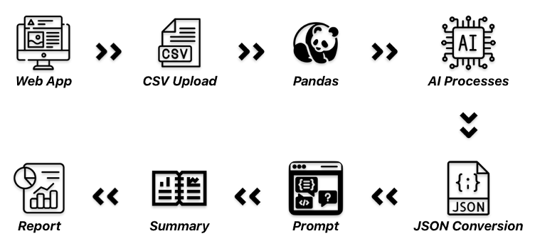

# insight-analyst
Insight Analyst is an LLM-powered SOC assistant. Its main purpose is to speed up the triage and summarization of security incidents. 
With this tool SOC work becomes extremely efficient and quick, allowing for the analyst to focus on work beyond triaging.
In turn it can result in a faster response time, a safer environment, and less downtime.

While this project is geared towards SOC analysts, this can be used by anyone with the appropriate hardware and software stack.

## Hardware Used
### Graphics Card
- Gigabyte GAMING OC GeForce RTX 4070
  - 12 GB VRAM
  - GDDR6X memory
  - Core clock 1920 MHz
  - Boost clock 2565 MHz
  - PCIe x16 interface
### CPU
- Intel Core i9-12900K
  - 16 cores
  - 24 threads
  - 3.2 GHz | up to 5.2 GHz
### Motherboard
- MSI MAG Z790 TOMAHAWK WIFI LGA1700
  - DDR4
  - x2 PCIe x16 slots
  - x5 M.2 slots
### Memory
- Corsair Vengeance RGB Pro 32 GB
  - 2 x 16 GB
  - DDR4
  - 3600 MHz
  - 18-22-22-42 timing
### Storage
- Samsung 990 Pro
  - 2 TB
  - M.2-2280 form factor
  - NVME
  - PCIe 4.0 interface

## Architecture

The architecture of Insight Analyst follows a specific path, ensuring the LLM takes certain steps before producing the final result. 
The precise steps are as follows:
1.	The end user will launch the web app using Streamlit UI. Stramlit is a Python library that will load the app.py file, containing the front and back-end code. 
2.	The user will then upload a CSV file for analyzing. This can be from Splunk or Windows Event Viewer.
3.	Pandas will read the CSV and ensure a smooth hand-off of data to the app. Pandas is a Python library used for reading data from files, it enables sorting, and it allows developers to combine different datasets. Alongside this is a function to help align Windows Event Viewer columns. This ensures correct data display in the Preview section of the final result. 
4.	The next step is to process this data; however, this may be an issue with larger files. To prevent any errors, the data must be truncated. This data will be sent to the model in multiple chunks, ensuring there are no overflows. This includes row limiting and only extracting a limited number of characters. The row count is limited to 200 and the characters are capped at 300. 
5.	This data will now need to be converted to JSON. Models do not understand CSV files, but rather structured data that is labeled. Converting to JSON is one of the best ways to prompt any model, as it will easily follow instructions, without having to clarify more than once. 
6.	All extracted data is now ready to send off, alongside the pre-defined prompt in the code. This prompt is sent by calling the local API server on the system. The model will respond as if it were being prompted in a chat.
7.	A summary of findings will be generated, including a preview of the CSV contents, an incident summary, Event IDs gathered, the scenario that unfolded, possible MITRE ATT&CK techniques, related Event IDs to look into, applications or services that should be looked into, how to contain and remove the malware or threat actor, future steps to ensure a hardened system, guidelines on verifying a clean machine, and a full markdown report.
8.	All of this will be displayed on the screen. Alongside that is the ability to download the markdown report that was created. This report is a copy of what was displayed on the screen.

## Why Did I Develop This?
Insight Analyst was conceptualized and developed in the fall of 2025 as I was finishing my senior year of college with a project/capstone class. 
With my degree being Cybersecurity, I felt that it would be a great time to experiment and learn what it is that LLMs can offer to people in my space. 
I was thinking about the problems I faced while being a member of the Indiana Tech Cyber Warriors, as we partake in cybersecurity competitions. 
I felt that, at times of being overwhelmed with tasks, I needed assistance analyzing incidents and determining possible next steps. 
That's the issue Insight Analyst will solve. 
Not asking it for the golden ticket to solve all my problems or telling it to hack my opponents like a nation-state hacker, but rather taking some weight off my shoulders in moments where I need to focus.

In all honesty, it started off as "just another school project", but it quickly turned into something more. 
Something meaningful and worthwhile that helped me grow and understand this incredible technology that keeps on improving. 
Though Insight Analyst never saw any competitions, I am sure that one day it will be useful, whether for me, or you, the reader.
